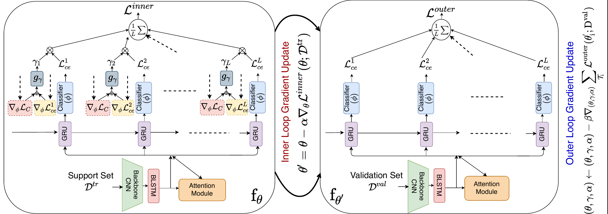
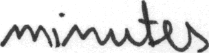
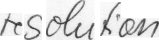

# MetaHTR

Implementation of the 2021 CVPR paper titled "MetaHTR: Towards Writer-Adaptive
Handwritten Text Recognition" by Bhunia et al. ([Arxiv link](https://arxiv.org/abs/2104.01876)).



The central idea is to use model-agnostic meta-learning (MAML) to make HTR models more
adaptive to unseen writers. The figure above shows the optimization process, involving
an inner loop (left) for writer-specific adaptation and an outer loop (right) for
learning underlying "meta-knowledge", optimizing for weights that can be rapidly
adapted to novel writers.

Compared to ordinary MAML, MetaHTR uses two additional ideas:
1. Learnable layer-wise learning rates: replace the MAML inner loop learning
    rate hyperparameter with a vector of learnable learning rates. This
    is the same idea as MetaSGD [[4]](#references) but applied layer-wise rather than
    parameter-wise.
2. Character instance-specific weights: weigh the character-specific loss values
   according to their relative importance using learned weights. The weights are
   calculated by passing a subset of the model gradients through an MLP, followed by a
   sigmoid activation. See the original paper for more details.

MetaHTR [[1]](#References) can be applied to most HTR models, due to its model-agnostic
nature. The authors try out 3 base models in their paper. I include the following
models in this repository:

* SAR [[2]](#References): LSTM-based architecture.
  Consists of a ResNet backbone, LSTM encoder, LSTM encoder, and 2D attention module.
  This model is also used in the MetaHTR paper.
* FPHTR [[3]](#References): Transformer-based architecture. Consists of a ResNet
  backbone combined with a Transformer decoder ([original
  repo](https://github.com/tobiasvanderwerff/full-page-handwriting-recognition)).

If you want to train these models yourself, they can be obtained from another Github
repository, which can be found [here](https://github.com/tobiasvanderwerff/htr). In the
original paper, the authors apply MetaHTR to an already trained HTR model. It may also
be possible to train a model using MetaHTR from randomly initialized weights, but in my
experience this does not work very well (and takes quite some time to run). More
realistically, MetaHTR is applied for 10-40 epochs on a trained model.


## Dataset





Word images from the IAM dataset are used for training/evaluating. Two
examples of word images from IAM are shown above. Download the
dataset [here](https://fki.tic.heia-fr.ch/databases/download-the-iam-handwriting-database).


## How to install
Run the instructions below to clone this repository and
install all the necessary dependencies (tested using Python 3.8).

```shell
# Clone this repository.
git clone https://github.com/tobiasvanderwerff/MetaHTR.git
cd MetaHTR

git submodule update --init       # initialize submodules
python3 -m venv env               # create a new virtual environment
source env/bin/activate           # activate the environment
pip install -r requirements.txt   # install requirements
pip install -e .                  # install this repo as a package
pip install -e htr                # install submodule containing base models
```

## Examples
Training MetaHTR using FPHTR as the base model:

```shell
cd metahtr
python train.py --main_model_arch metahtr \
                --base_model_arch fphtr \
                --use_instance_weights \
                --trained_model_path /path/to/torch/base/model/checkpoint \
                --iam_dir /path/to/iam \
                --learning_rate 3e-5 \
                --shots 16 \
                --ways 8 \
                --use_cpu
```

Run `train.py -h` to see a full list of arguments.

The `eval.py` script can be used to run evaluation on the IAM validation or test set.
For example:
```shell
cd metahtr
python eval.py --trained_model_path /path/to/metahtr/checkpoint \
               --iam_dir /path/to/iam \
               --use_cpu
```

## Using other base models
Currently, only the two base models mentioned above are supported. However, MetaHTR
and MAML in particular can be applied to most architectures without any real
modifications. In other words, it should be possible to use MetaHTR on your HTR
model of choice. I may add some code/instructions in the future to make this possible.


## Results
TODO

## Other remarks

### Pytorch Lightning Warning
When running the training or evaluation script, you will most likely see two of the
following warnings:

```
UserWarning: Found keys that are in the model state dict but not in the checkpoint: [...]
```

This warning can safely be ignored. It occurs because the weights from a checkpoint are
loaded in two stages: first, the weights of the base model are loaded, and second, the
weights of the meta-model are loaded (if they exist). Pytorch Lightning will complain
because the weights that are loaded do not cover all weights in the model.


### Memory usage
MAML, and MetaHTR in particular, are quite resource-hungry. Therefore, it's possible
that you will run out of GPU memory. Trying a smaller base model is a potential solution
for this. Another way to reduce memory is by disabling the character
instance-specific weights, which can be done by omitting the
`--use_instance_weights` flag passed to `train.py`.

## TODO
- Add more info on using other base models
- Decide on finetuning model
- Add results


## References
[1] Bhunia, Ayan Kumar, et al. "Metahtr: Towards writer-adaptive handwritten text
recognition." Proceedings of the IEEE/CVF conference on computer vision and pattern
recognition. 2021. [Arxiv link](https://arxiv.org/abs/2104.01876)

[2] Li, Hui, et al. "Show, attend and read: A simple and strong baseline for irregular
text recognition." Proceedings of the AAAI conference on artificial intelligence.
Vol. 33. No. 01. 2019. [Arxiv link](https://arxiv.org/abs/1811.00751)

[3]  Singh, Sumeet S., and Sergey Karayev. "Full page handwriting recognition via image
to sequence extraction." International Conference on Document Analysis and Recognition.
Springer, Cham, 2021. [Arxiv link](https://arxiv.org/abs/2103.06450)

[4] Li, Zhenguo, et al. "Meta-sgd: Learning to learn quickly for few-shot learning."
arXiv preprint arXiv:1707.09835 (2017). [Arxiv link](https://arxiv.org/abs/1707.09835)
